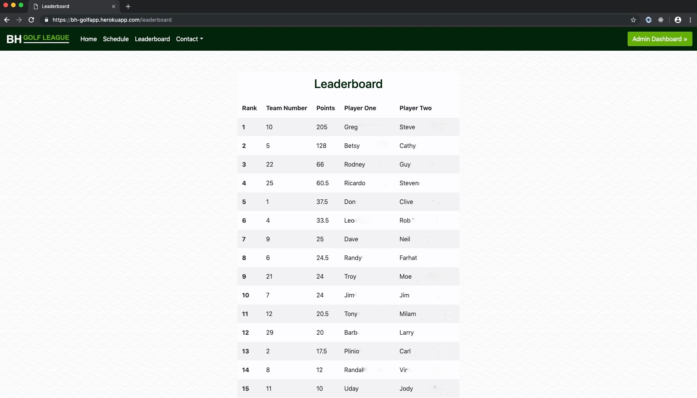

# BH Golf League App

Live link: https://bh-golfapp.herokuapp.com/

Bayou-Houston (BH) Golf League App is a scoring and tracking system for a Houston area Golf League. Users are able to input scores, view their weekly quotas, and view the schedule. League administrators are able to add admins, create seasons, add new players and teams, manage existing teams, and archive most recent season to create a new season.

## Admin credentials
We are not currently providing admin credentials because admin privileges would allow user to disrupt current season by archiving season, adding/deleting players teams, and adding more admins.

## Player credentials
For similar reasons we are not providing player login credentials. Someone could add scores and disrupt the leaderboard. However, please view gifs below to see the website in action and the live link allows one to see some aspects of the website.

 

Admins are able to set up current season and archive previous season.

 

 

Users are able to input scores for team and log no shows.

 

 

Users are able to view match schedule by week number.

 

 

Users are able to view current leaderboard:

  

 

# Collaborators:
* [Steve Cattanach](https://github.com/stevecatt)
* [Summer Feiler](https://github.com/spfeiler)
* [Will Roberts](https://github.com/wcrober)
* [Shaun Colley](https://github.com/shaunwcolley)
